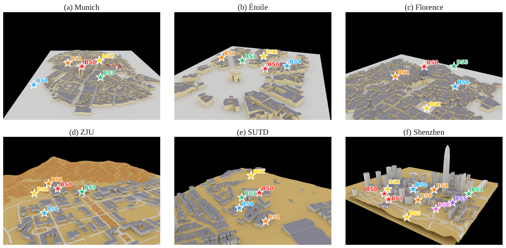
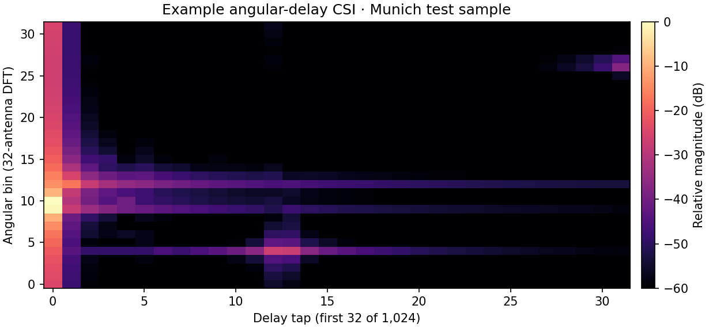

# RT-CSI: Sionna-RT-Mix5 and Shenzhen

RT-CSI is a ray-traced channel-state-information (CSI) feedback dataset built
with **NVIDIA Sionna RT 2.0.1**. **Sionna-RT-Mix5** combines three public city
scenes (Munich, Paris Étoile, Florence) with two custom campus scenes (ZJU,
SUTD). A separate Shenzhen Futian CBD scene tests transfer to a dense
high-rise environment. This repository contains the channel data, the
scene geometry needed to regenerate custom-scene channels, and the data
generation code. It contains no model implementation.



*Six benchmark scenes. The first five form Mix5; Shenzhen is held out. Figure
converted from the author-provided `Sionna_scearnio.pdf`. City geometry uses
OpenStreetMap data; see [attribution](#license-and-attribution).*

## Dataset at a glance

| Scene | Source and role | BSs | UE radius / BS | Train | Val | Test |
|---|---|---:|---:|---:|---:|---:|
| Munich | Sionna RT city; Mix5 | 5 | 300 m | 24,000 | 8,000 | 8,000 |
| Paris Étoile | Sionna RT city; Mix5 | 5 | 250 m | 24,000 | 8,000 | 8,000 |
| Florence | Sionna RT city; Mix5 | 5 | 300 m | 24,000 | 8,000 | 8,000 |
| ZJU | OSM/Blosm campus; Mix5 | 5 | 300 m | 24,000 | 8,000 | 8,000 |
| SUTD | OSM/Blosm campus; Mix5 | 5 | 300 m | 24,000 | 8,000 | 8,000 |
| **Mix5 combined** | Concatenation of the five rows above | — | — | **120,000** | **40,000** | **40,000** |
| **Shenzhen Futian CBD** | OSM/Blosm; held-out test | 10 | 400 m | — | — | **40,000** |

Each count is a **channel sample**. Mix5 keeps one serving-BS link per UE.
Shenzhen stores every valid UE-BS link, so one UE position can appear in
several samples with different `bs_id` values. The Mix5 combined file is a
convenience copy of the five scene files; it adds no new channels.

The filenames say `3GHz` for historical compatibility. The actual carrier
frequency is **3.5 GHz**, as recorded in each file's `config` metadata.

### Channel and propagation settings

| Setting | Mix5 | Shenzhen |
|---|---|---|
| Carrier / bandwidth / subcarriers | 3.5 GHz / 20 MHz / 1,024 | Same |
| BS / UE arrays | 32-element ULA / single antenna; vertical polarization, isotropic pattern | Same |
| UE candidates | 1 m × 1 m grid, 1.5 m above local terrain, inside the union of BS-centred disks | Same, with a street-elevation filter |
| BS choice | Five height-ranked rooftop candidates with minimum lateral separation; campus bounding boxes constrain ZJU and SUTD | Ten rooftop candidates with 25–50 m roof height above terrain; antenna mount is 2.5 m higher |
| PathSolver maximum depth | 5 | 7 |
| Propagation | LoS, specular reflection, refraction, diffraction | Same, plus diffuse reflection with `scattering_coefficient=0.1` |
| Link storage | Strongest BS by aggregate gain across antennas and subcarriers | All valid UE-BS links, tagged by BS index |

Scene-specific parameters and random seeds are in [`configs/`](configs/).
The three NVIDIA city scenes load from the installed Sionna RT package.
The custom Mitsuba XML files and referenced PLY meshes are in [`scenes/`](scenes/).

## What's in an NPZ file?

The primary arrays are `x_train`, `x_val`, and `x_test`. Each row has shape
`(2, 32, 32)` and dtype `float32`: channel 0 is the real part, channel 1 the
imaginary part, followed by angular bin and retained delay tap. The generator
applies a 32-point antenna DFT, a 1,024-point subcarrier IFFT, and keeps the
first 32 delay taps. It scales each sample by the largest absolute real or
imaginary coefficient, then maps it into `[0, 1]`:

```text
s = max(max(abs(real)), max(abs(imag)))
x = 0.5 * H_angular_delay / s + 0.5
```

Thus `0.5` represents a zero channel coefficient. The scalar `scale` is NaN
because normalization is **per sample**, not global. Shenzhen files also
include `x_*_raw` and the corresponding per-sample `scale_*` values.

| Key | Meaning |
|---|---|
| `x_{train,val,test}` | Normalized CSI, `(N, 2, 32, 32)` |
| `pos_{train,val,test}` | UE positions in local scene coordinates, metres; `(N, 3)` |
| `bs_id_{train,val,test}` | Serving BS on Mix5 or link BS on Shenzhen; `(N,)` |
| `bs_positions` | Local XYZ positions of the BSs; `(5, 3)` or `(10, 3)` |
| `config` | JSON string with physical settings and actual split counts |
| `scene_id_{train,val,test}` | Only in combined Mix5: scene index 0–4 |

The combined Mix5 `scene_id` order is **Étoile, ZJU, SUTD, Florence,
Munich**. Its archive omits `bs_id_*` and `bs_positions`; use the five
per-scene archives if you need those fields.



*Example normalized angular-delay channel: Munich test sample 100. The plot
shows relative magnitude in dB after mapping stored values back around zero.*

## Use the data

Reading an NPZ only requires NumPy:

```python
import json
import numpy as np

with np.load("data/csi_munich_3GHz_32x1024.npz", allow_pickle=False) as ds:
    x_test = ds["x_test"]                    # (8000, 2, 32, 32), in [0, 1]
    ue_xyz = ds["pos_test"]                 # (8000, 3), local metres
    serving_bs = ds["bs_id_test"]           # (8000,)
    settings = json.loads(str(ds["config"]))

centered_csi = (x_test - 0.5) * 2.0          # signed normalized Re/Im
print(x_test.shape, settings["frequency_hz"])
```

For joint training, read `data/csi_combined5_3GHz_32x1024.npz` and use its
`x_train` and `x_val`. For the paper's per-scene results, evaluate each of
the five scene files' `x_test` separately. Zero-shot and fine-tuned Shenzhen
evaluation use **all 40,000** rows of
`data/csi_SHENZHEN_test_3GHz_32x1024.npz`.

The original few-shot archives are named
`csi_SHENZHEN_train{200,400,800,1600,3200,6400,12800}_3GHz_32x1024.npz`.
They contain an 80/20 train/validation split and preserve the exact inputs
used in the paper experiments. Files with `_disjoint.npz` suffix are a
separate corrected alternative: UE positions shared with the fixed test are
removed, and train/validation are split by UE position. Their actual sample
counts are smaller than the nominal number in the filename; results from
these files require fresh evaluation. Details are in
[`docs/release-audit.md`](docs/release-audit.md).

## Generate or inspect channels

The dataset is ready to read without Sionna. To run the generator, install
the pinned Python dependencies and use the single `rt-csi` command:

```bash
uv sync
uv run rt-csi --help
uv run rt-csi inspect data/csi_SHENZHEN_test_3GHz_32x1024.npz
uv run rt-csi generate --scene all --out-dir regenerated
uv run rt-csi combine --scene-dir regenerated --out regenerated/mix5.npz
uv run rt-csi generate --scene SHENZHEN_test --out regenerated/shenzhen_test.npz
uv run rt-csi generate --scene SHENZHEN_train --target-samples 3200 --out regenerated/shenzhen_train3200.npz
uv run rt-csi disjoint-fewshot --out-dir regenerated/disjoint-fewshot
```

`generate --scene all` means the five Mix5 scenes; Shenzhen has separate
test and few-shot configurations. Ray tracing is computationally expensive.
The bundled NPZ files are the canonical samples. The custom scene-building
Blender scripts are retained under `src/rt_csi/blender/`; they require
external add-ons and are described in
[`docs/scene-building.md`](docs/scene-building.md).

To check downloaded data files, run `sha256sum -c MANIFEST.sha256`.

## Repository layout

```text
RT-CSI-release/
├── README.md, pyproject.toml, uv.lock, licenses, MANIFEST.sha256
├── assets/          # README scene figure and channel example
├── configs/         # common and per-scene generation parameters
├── data/            # 21 NPZ archives, flat and searchable by filename
├── docs/            # provenance, license scope, paper alignment
├── scenes/          # ZJU, SUTD, Shenzhen XML and PLY geometry
└── src/rt_csi/      # generator, transforms, CLI, and Blender recipes
```

The data directory is about 3 GB. `.gitattributes` marks NPZ files for Git
LFS; install Git LFS before adding the data to a Git repository.

## License and attribution

Original code is MIT licensed; generated CSI NPZ files are CC BY 4.0. The
scope is stated in [`docs/license-scope.md`](docs/license-scope.md). The custom
scene geometry incorporates OpenStreetMap data: **© OpenStreetMap
contributors**, [ODbL 1.0](https://www.openstreetmap.org/copyright).
NVIDIA's [scene documentation](https://nvlabs.github.io/sionna/rt/api/scene.html)
also identifies its three city scenes as OSM derived. Blosm's
[terrain documentation](https://github.com/vvoovv/blosm/wiki/Terrain)
identifies Mapzen terrain tiles as its source; the original scene records do
not specify the exact downloaded tiles. Review the applicable terrain
attribution before publicly uploading `scenes/`. See
[`docs/third-party-notices.md`](docs/third-party-notices.md).
